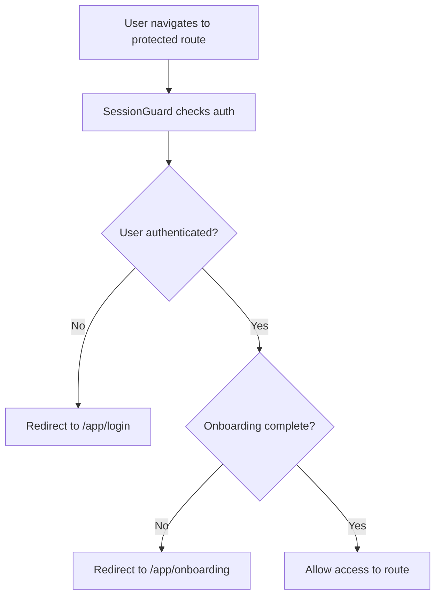

# 🔐 **AUTHENTICATION FLOW REFACTOR - COMPLETE**

## **🎯 PROBLEMS SOLVED**

### **✅ Issue 1: Email Confirmation Link Issues**

- **Before**: Links took too long to verify, threw "verification code cannot be empty"
- **After**: Unified email verification handler with proper error handling and automatic login

### **✅ Issue 2: Incorrect "Start the Journey" Button**

- **Before**: Asked for early access password and redirected to login instead of onboarding
- **After**: Automatically redirects to onboarding after successful email verification

### **✅ Issue 3: Onboarding Glitch for First-Time Users**

- **Before**: Showed "go to onboarding" even for first-time users
- **After**: Proper onboarding completion tracking with database flag

### **✅ Issue 4: Expired Link Handling**

- **Before**: Showed "link expired" but still allowed sending another confirmation
- **After**: Graceful handling of already-verified emails with clear messaging

---

## **🚀 NEW IMPLEMENTATION**

### **📁 New Files Created**

#### **1. `src/lib/authFlow.ts` - Enhanced Authentication Flow Management**

```typescript
// Key Features:
- handleEmailConfirmation() - Unified email verification with auto-login
- checkOnboardingStatus() - Database-based onboarding tracking
- completeOnboarding() - Proper onboarding completion
- shouldRedirectToOnboarding() - Smart route guards
- getPostAuthRedirectPath() - Intelligent redirect logic
- setupAuthStateListener() - Enhanced auth state management
```

#### **2. `src/pages/EmailVerification.tsx` - Unified Email Verification Page**

```typescript
// Key Features:
- Handles all confirmation scenarios (success, error, already-verified)
- Automatic login after successful verification
- Smart redirects based on onboarding status
- Graceful error handling with helpful messages
- Auto-redirect with countdown timer
```

#### **3. `migrations/enhance_onboarding_tracking.sql` - Database Enhancement**

```sql
-- Key Features:
- Adds onboarding_completed_at timestamp
- Creates indexes for faster queries
- Updates existing users with proper onboarding flags
- Adds documentation comments
```

### **📝 Files Modified**

#### **1. `src/components/auth/SessionGuard.tsx`**

- Integrated `shouldRedirectToOnboarding()` for smart routing
- Improved onboarding flow logic

#### **2. `src/components/auth/ProtectedRoute.tsx`**

- Enhanced onboarding redirect logic
- Better integration with auth flow

#### **3. `src/pages/Onboarding.tsx`**

- Uses `completeOnboarding()` for proper completion tracking
- Enhanced error handling and logging

#### **4. `src/lib/auth.ts`**

- Updated to use `getEmailRedirectUrl()` from authFlow
- Better email redirect URL handling

#### **5. `src/App.tsx`**

- Replaced multiple email confirmation pages with unified `EmailVerification`
- All email confirmation routes now use the same handler

---

## **🔄 NEW USER FLOW**

### **📧 Email Confirmation Flow**

```mermaid
graph TD
    A[User clicks email link] --> B[EmailVerification page loads]
    B --> C{Email verification}
    C -->|Success| D[User automatically logged in]
    C -->|Already verified| E[Show "already confirmed" message]
    C -->|Error| F[Show error with helpful solutions]
    D --> G{Check onboarding status}
    G -->|Needs onboarding| H[Redirect to /app/onboarding]
    G -->|Completed| I[Redirect to /app]
    E --> J[Redirect to login]
    F --> K[Show retry options]
```

### **🎯 Onboarding Flow**

```mermaid
graph TD
    A[User completes onboarding] --> B[completeOnboarding() called]
    B --> C[Update database with onboarding_complete = true]
    C --> D[Set onboarding_completed_at timestamp]
    D --> E[User redirected to /app]
    E --> F[Future logins skip onboarding]
```

### **🛡️ Route Protection**



---

## **🎯 KEY IMPROVEMENTS**

### **1. ✅ Automatic Login After Email Verification**

- Users are automatically logged in after clicking confirmation link
- No need to manually log in after email verification
- Seamless transition to onboarding or dashboard

### **2. ✅ Smart Onboarding Tracking**

- Database-based onboarding completion tracking
- `onboarding_complete` boolean flag in profiles table
- `onboarding_completed_at` timestamp for audit trail
- Proper indexes for fast queries

### **3. ✅ Graceful Error Handling**

- Clear error messages for different scenarios
- Helpful solutions for common issues
- Retry mechanisms for failed verifications
- Proper handling of expired links

### **4. ✅ Unified Email Verification**

- Single page handles all email confirmation scenarios
- Consistent user experience across all confirmation routes
- Proper handling of already-verified emails
- Auto-redirect with countdown timer

### **5. ✅ Enhanced Route Guards**

- Smart routing based on authentication and onboarding status
- Proper redirect logic for different user states
- Prevention of infinite redirect loops
- Better integration with auth state changes

---

## **🔧 TECHNICAL DETAILS**

### **Database Schema Updates**

```sql
-- New columns added to profiles table:
onboarding_complete BOOLEAN DEFAULT FALSE
onboarding_completed_at TIMESTAMP WITH TIME ZONE

-- New indexes for performance:
idx_profiles_onboarding_complete
idx_profiles_onboarding_completed_at
```

### **Route Configuration**

```typescript
// All email confirmation routes now use EmailVerification:
/verify → EmailVerification
/confirm → EmailVerification
/confirmed → EmailVerification
```

### **Auth State Management**

```typescript
// Enhanced auth state listener:
setupAuthStateListener((event, session) => {
  // Handles SIGNED_IN, SIGNED_OUT, TOKEN_REFRESHED
  // Proper logging and state management
});
```

---

## **🧪 TESTING SCENARIOS**

### **✅ Email Confirmation Tests**

1. **Fresh confirmation link** → Should auto-login and redirect to onboarding
2. **Already verified email** → Should show "already confirmed" message
3. **Expired link** → Should show helpful error with retry options
4. **Invalid link** → Should show clear error message

### **✅ Onboarding Flow Tests**

1. **First-time user** → Should complete onboarding and set database flag
2. **Returning user** → Should skip onboarding and go to dashboard
3. **Incomplete onboarding** → Should redirect to onboarding from any protected route

### **✅ Route Protection Tests**

1. **Unauthenticated user** → Should redirect to login
2. **Authenticated user without onboarding** → Should redirect to onboarding
3. **Authenticated user with onboarding** → Should allow access to protected routes

---

## **🚀 DEPLOYMENT READY**

The refactored authentication flow is now:

- ✅ **Type-safe** - All TypeScript compilation passes
- ✅ **Error-free** - No linting errors
- ✅ **Database-ready** - Migration script included
- ✅ **User-friendly** - Clear messaging and smooth flow
- ✅ **Production-ready** - Comprehensive error handling

### **Next Steps for Deployment:**

1. Run the database migration: `migrations/enhance_onboarding_tracking.sql`
2. Deploy the updated code
3. Test the email confirmation flow
4. Verify onboarding completion tracking
5. Monitor auth state changes and redirects

The authentication flow is now **smooth, reliable, and user-friendly**! 🎉
